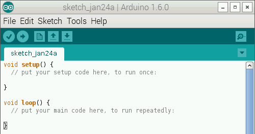

Arduino IDE 1.6.3 for Raspberry Pi
==================================



All credit goes to ShortTie who made this awesome patch.
This repository hosts compiled packages, the patches and additional instructions and notes.

See the post at the [Raspberry Pi Forum](https://www.raspberrypi.org/forums/viewtopic.php?f=66&t=92662) for all information and support.

[Contact me.](http://www.NicoHood.de)

How to Install
==============

This installation method works on all Raspberry Pi models (A, B, A+, B+, B2) under Raspbian.

You need to upgrade a few packages from the Jessie packages.
I noticed some problems after the modification, for example I could not install the program Scrot after the upgrade.
You can also do a full Jessie upgrade (see how to recompile section below).

```bash
# update the current system
sudo su
apt-get update
apt-get upgrade
apt-get dist-upgrade
```

```
# add these lines at the bottom (Ctrl + X, Y, Enter):
nano /etc/apt/sources.list

deb http://mirrordirector.raspbian.org/raspbian/ jessie main contrib non-free rpi
deb http://archive.raspbian.org/raspbian jessie main contrib non-free rpi
```

```
# add the following lines at the bottom (Ctrl + X, Y, Enter):
nano /etc/apt/preferences

Package: *
Pin: release n=wheezy
Pin-Priority: 900
 
Package: *
Pin: release n=jessie
Pin-Priority: 300
 
Package: *
Pin: release o=Raspbian
Pin-Priority: -10
```

```bash
# install the newest avr-gcc first
apt-get update
apt-get -t jessie install gcc-avr
 
# install missing packages for the IDE (say yes to the message)
apt-get -t jessie install avrdude avr-libc libjssc-java libastylej-jni libcommons-exec-java libcommons-httpclient-java libcommons-logging-java libjmdns-java libjna-java libjsch-java

# download latest release (this may take a while)
git clone https://github.com/NicoHood/Arduino-IDE-for-Raspberry.git
cd Arduino-IDE-for-Raspberry/

# uninstall older releases
apt-get remove -y arduino arduino-core

# install new release
dpkg -i arduino-core_1.6.3_all.deb arduino_1.6.3_all.deb
```

Known bugs
==========

* You have to start the IDE as superuser (sudo arduino)
* Custom cores cannot be used unless you modify the platform.txt
* Serial ports cannot be opened???

How to recompile
================

In order to recompile you need to upgrade your Raspbian from Wheezy to Jessie.
Please backup your system before you do this.

While the system is upgraded it will ask you to change a few configs.
Always say 'N', except to lightdm.conf say 'Y'.
If you missed it your login screen wont have a picture and some other things might be wrong for the graphical desktop.
It shouldn't matter for the recompiling though.

```bash
# switch source to jessie and upgrade
sudo su
sed -i 's/wheezy/jessie/' /etc/apt/sources.list
apt-get update
apt-get dist-upgrade -y

# fix auto login
sed -i 's/#autologin-user=/autologin-user=pi/' /etc/lightdm/lightdm.conf
reboot

# get admin privileges after reboot
sudo su

# create/switch to a new working directory
mkdir Arduino
cd Arduino

# download Arduino IDE and extract (both take a while)
wget https://github.com/arduino/Arduino/archive/1.6.3.zip
unzip -q 1.6.3.zip
cd Arduino-1.6.3/

# get arduino for debian
wget http://ftp.de.debian.org/debian/pool/main/a/arduino/arduino_1.5.6.2+sdfsg2-3.debian.tar.xz
tar -xf arduino_1.5.6.2+sdfsg2-3.debian.tar.xz
cd debian

# download patch and apply
wget https://raw.githubusercontent.com/NicoHood/Arduino-IDE-for-Raspberry/master/patches/Raspbian.Arduino.arm.build.1.6.3.patch
patch -p1 < Raspbian.Arduino.arm.build.1.6.3.patch
cd ..

# make deb's (apt-get install any missing build dependencies and rerun)
dpkg-buildpackage -uc -b -tc

# install new IDE
cd ..
apt-get remove -y arduino arduino-core
dpkg -i arduino-core_1.6.3_all.deb arduino_1.6.3_all.deb

```

How to upgrade to a new IDE version
===================================

Current IDE outdated? Want to put your hands on this and help to update the IDE?
Here are the instructions, assuming you want to upgrade 1.6.2 to 1.6.3.
Assuming you have upgraded your system to Jessie as described above.

More detailed information on how to upgrade can be found [here](https://www.raspberrypi.org/forums/viewtopic.php?p=733130#p733130).
Don't be frustrated if it doesn't work for you, I also had some problems.

```bash
# get admin privileges
sudo su

# create/switch to a new working directory
mkdir Arduino
cd Arduino

# install quilt and export some variables
apt-get install quilt
export QUILT_PATCHES=debian/patches
export QUILT_REFRESH_ARGS="-p ab --no-timestamps --no-index"

# download the latest Arduino IDE and extract
wget https://github.com/arduino/Arduino/archive/1.6.3.zip
unzip -q 1.6.3.zip
cd Arduino-1.6.3/

# get arduino for debian and backup
wget http://ftp.de.debian.org/debian/pool/main/a/arduino/arduino_1.5.6.2+sdfsg2-3.debian.tar.xz
tar -xf arduino_1.5.6.2+sdfsg2-3.debian.tar.xz
cp -R debian debian.orig
cd debian

# download last patch and apply
wget https://www.dropbox.com/s/7m8gzlbxsh6psex/Raspbian.Arduino.arm.build.1.6.2.patch
patch -p1 < Raspbian.Arduino.arm.build.1.6.2.patch
rm Raspbian.Arduino.arm.build.1.6.2.patch
cd ..

# go through each patch with
quilt push

# correct error in patch, retry
# for fuzz do
quilt refresh

# for error search the patch and look at the source what has changed
nano /debian/patches/filename.patch

# after all errors are gone do
quilt pop -a
quilt push -a
quilt pop -a

# check if there are files ending with ~
# if yes, delete them
ls -a debian/patches/


# calculate the new patch for other people
diff -ruN debian.orig debian > Raspbian.Arduino.arm.build.1.6.3.patch
```

